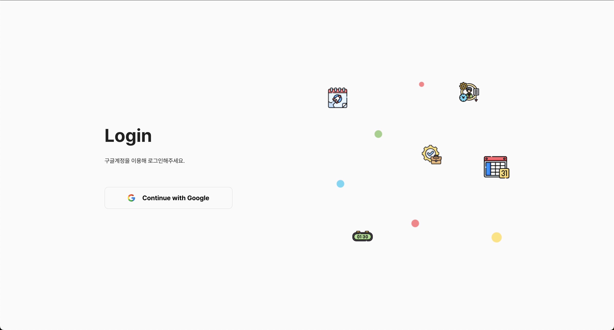
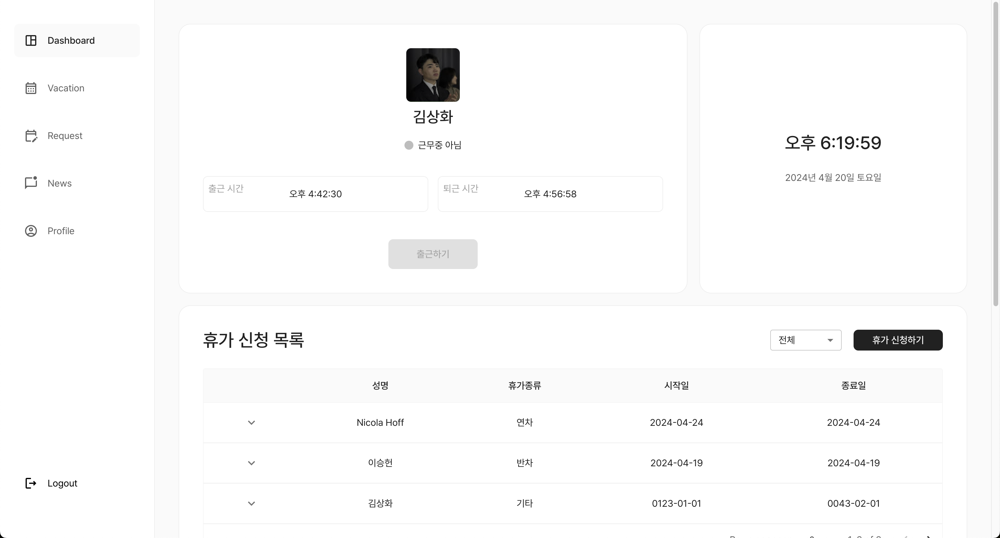
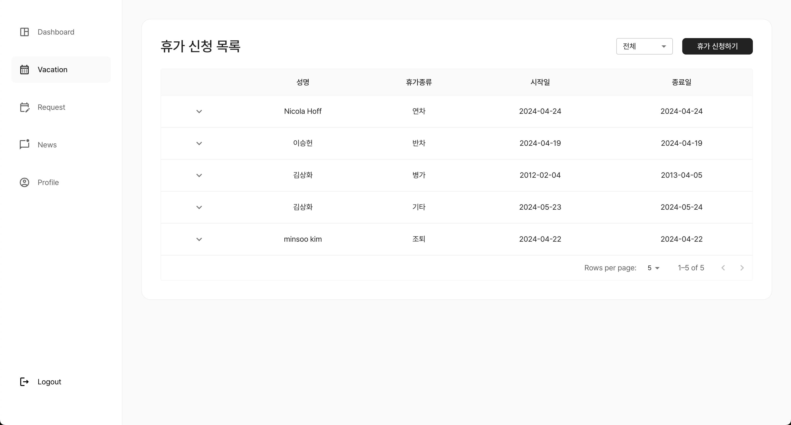
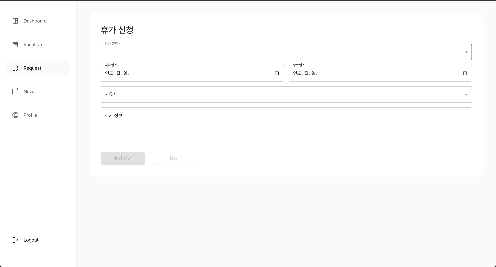
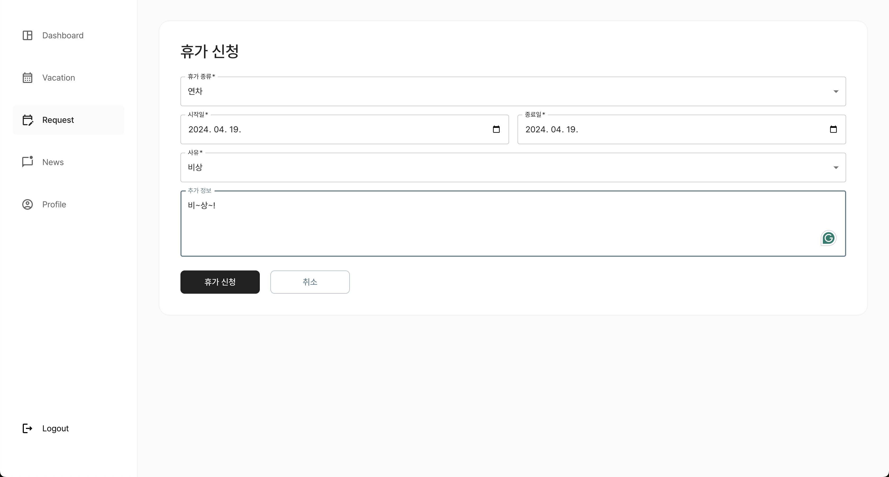
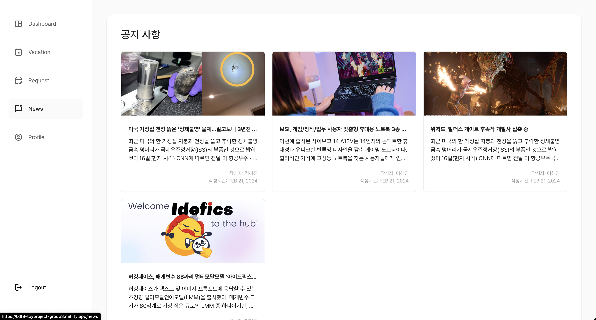
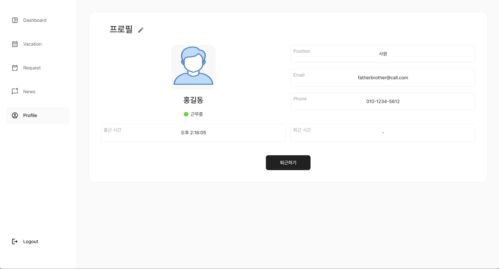
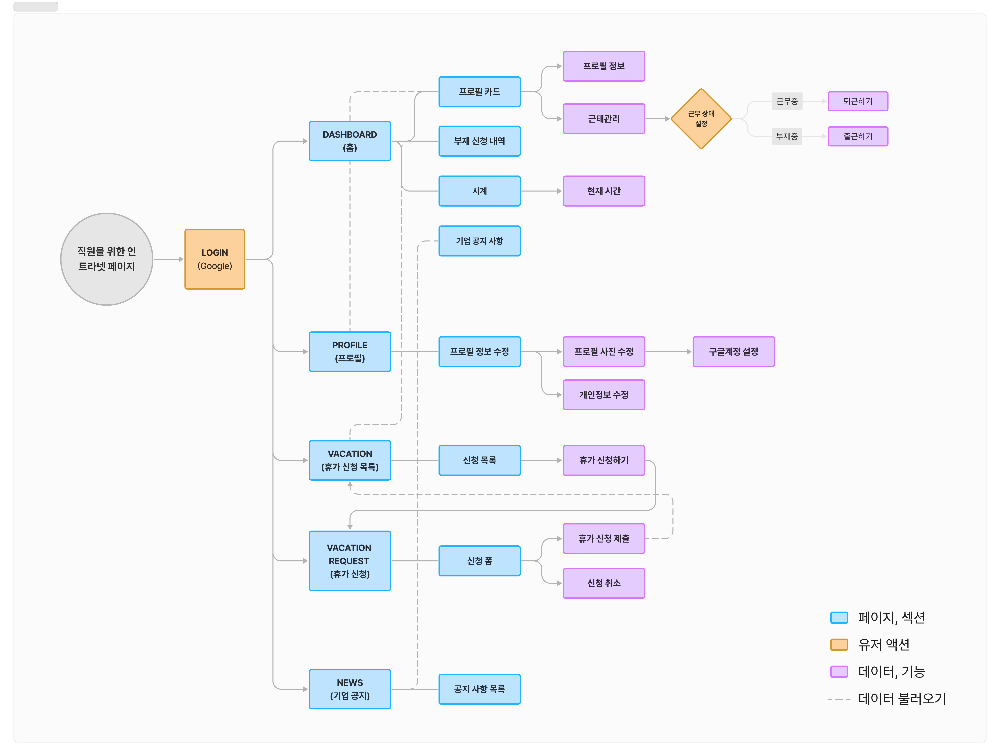

# **[👨‍💻 토이프로젝트1 - 3조]**

[배포사이트](https://kdt8-toyproject-group3.netlify.app/login)  
인트라넷 서비스를 제작했습니다.  
React, TypeScript, Context API, Firebase, ESLint, Figma 등을 사용했습니다.

---

### 팀원

- 승헌 : 파이어베이스 이용해 Google OAuth 로그인 구현, News/SideBar 구현 
- 상화 : 개발환경 구축, 휴가정보 표시 페이지(Vacation tab) 구현, Context API 적용하여 상태 관리, FireStore에 휴가정보 등록
- 니콜라: 휴가신청(Request) 페이지 구현, MUI 테마/팔렛 설정 및 적용, 웹사이트 스타일링 (UI 디자인, CSS 및 반응형 작업)
- 민수 : 프로필 페이지(Profile page) 구현, Context API 상태관리, FireStore 출퇴근 정보 등록

---

### 기간

📆 24.04.08 ~ 24.04.20

---

### 페이지 소개

#### 0. Login

#### 1. Dashboard

#### 2. Vacation

#### 3. Request

#### 4. News

#### 5. Profile

---

#### UserFlow

---

### 필수 요구사항

1. [x] 마이페이지 구현
    - [x] 연차/ 반차/시간 조정 등 부재 신청 창 구현
    - [x] 부재 신청 내역 확인 창 구현
    - [x] 부재 항목에 따른 필터링 기능 구현
    - [x] 사진, 직무, 이름이 표기된 프로필 구현
        - [x] 시간 관리 기능 개발
        - [x] 현 시각을 표시하는 시계 (타이머) 구현
        - [x] 토글 형태의 근무 시작 / 종료 스위치 구현
        - [x] 모달을 활용한 근무 시작 / 종료 확인 창 구현
2. [x] 기업 공지 모음 갤러리 구현(업로드 기능은 포함 x)
3. [x] netlify 등을 이용한 정적 페이지 배포
4. [x] [README.md](http://readme.md/) 파일 작성
    - [x] 팀원별로 구현한 부분 소개

### 진행한 선택 요구사항

- [x] TypeScript 사용
- [x] 마이페이지의 사진 업로드 기능
- [x] 로그인 기능 (Firebase를 활용한 구글 OAuth)
- [x] 부재 신청시, 사유 기재 기능
- [x] eslint 설정